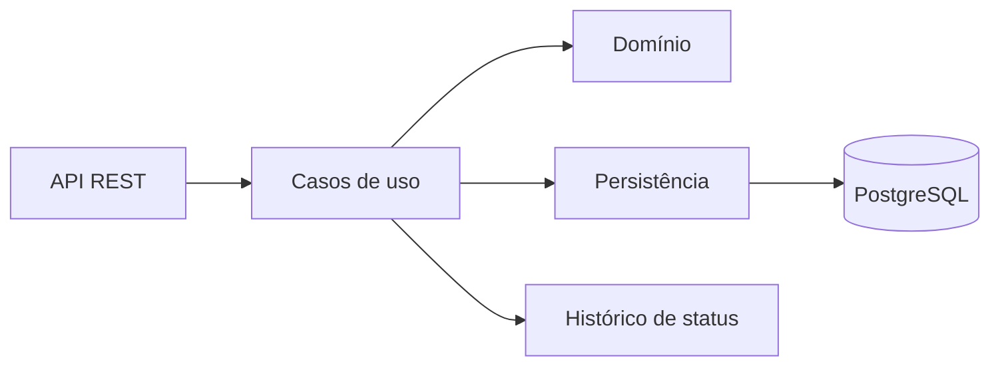
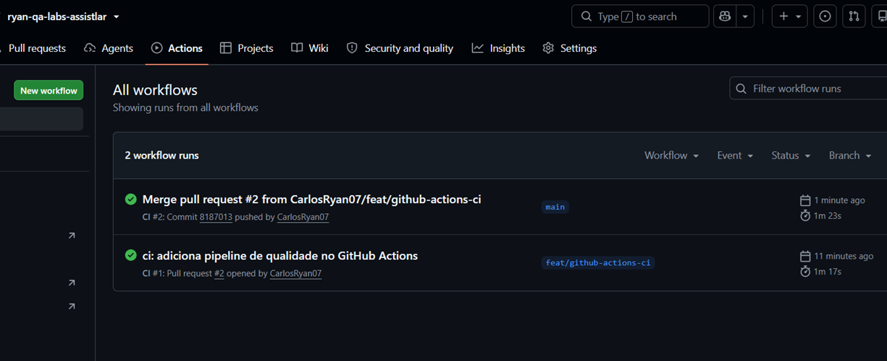
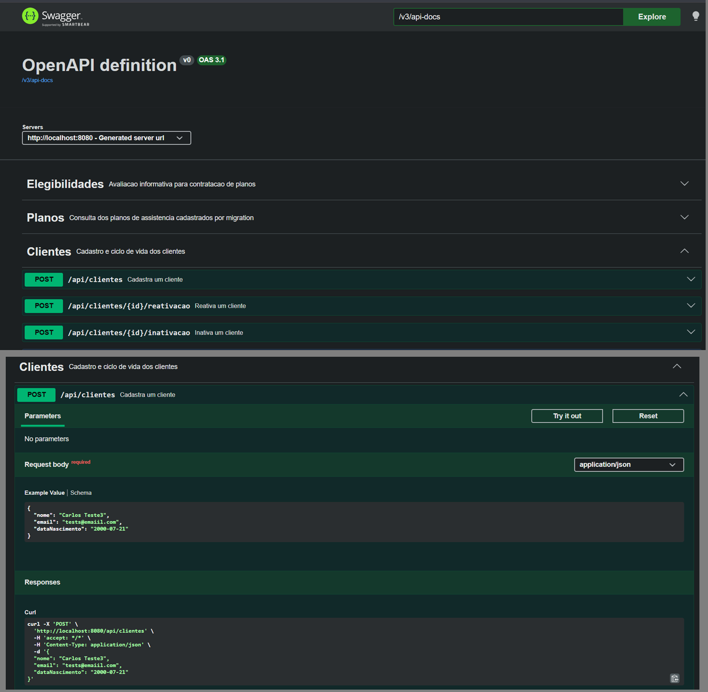
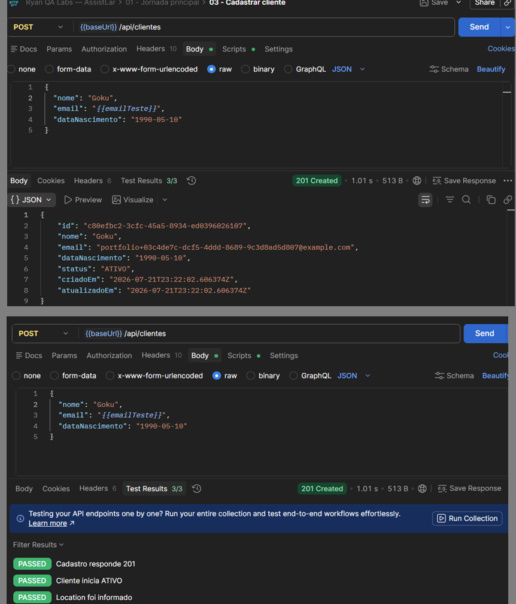
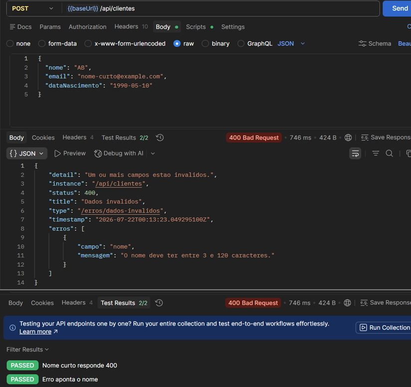
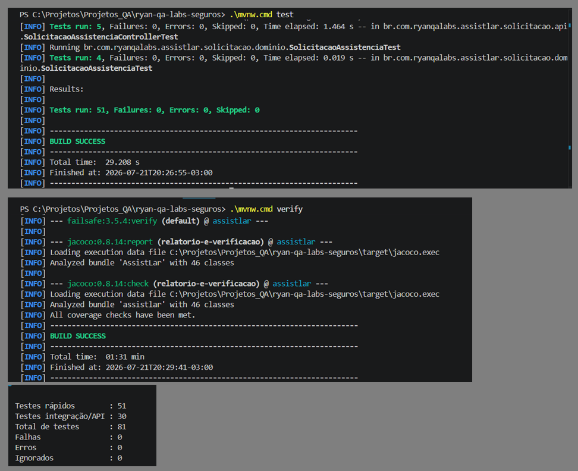
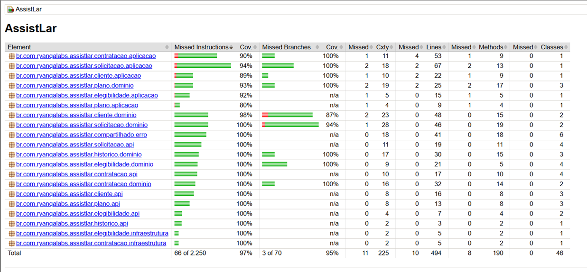
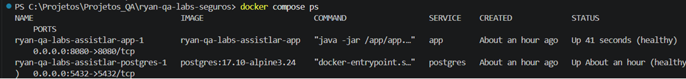

# Ryan QA Labs — AssistLar

[](https://github.com/CarlosRyan07/qa-labs-assistlar/actions/workflows/ci.yml)
[](https://github.com/CarlosRyan07/qa-labs-assistlar/releases/latest)


[](LICENSE)

Plataforma fictícia de assistências residenciais desenvolvida para demonstrar práticas de Quality Engineering em uma aplicação autoral, controlada e próxima de um produto real.

> Este projeto é exclusivamente educacional. Não representa nem reproduz sistemas, dados, nomes ou regras de empresas reais.

## Resultados em números

- **81 testes automatizados**
- **51 testes rápidos**
- **30 testes de integração e API**
- **97,07% de cobertura de instruções**
- **95,71% de cobertura de branches**
- **31 requisições na collection Postman**
- **18 caminhos documentados no OpenAPI 3.1**
- **Release atual: v0.1.0**

## Acesso rápido

- [Release v0.1.0](https://github.com/CarlosRyan07/qa-labs-assistlar/releases/tag/v0.1.0)
- [Evidências reproduzíveis](docs/evidencias.md)
- [Estratégia de testes](#estratégia-de-testes) e [catálogo de cenários](docs/cenarios-de-teste.md)
- [Arquitetura do AssistLar](docs/arquitetura.md)
- [Guia de execução local](docs/execucao-local.md)
- [Collection Postman](postman/README.md) — requer a aplicação local em execução para enviar as requisições
- [Swagger UI](http://localhost:8080/swagger-ui.html) e [contrato OpenAPI](http://localhost:8080/v3/api-docs) — disponíveis somente com a aplicação local em execução

## O que o AssistLar demonstra

- regras de negócio testáveis e estados com transições explícitas;
- testes unitários, de controller, integração, API, banco e concorrência;
- PostgreSQL real nos testes com Testcontainers, sem H2;
- migrations versionadas e validadas com Flyway;
- erros REST consistentes com `ProblemDetail`;
- contrato OpenAPI verificado automaticamente;
- quality gate de cobertura com JaCoCo;
- ambiente reproduzível com Docker Compose.

## Domínio do MVP

O AssistLar permite cadastrar clientes, consultar planos, avaliar elegibilidade, criar e ativar contratações e solicitar serviços de eletricista, encanador ou chaveiro.

Os planos são carregados por migration:

| Plano | Eletricista | Encanador | Chaveiro |
|---|---:|---:|---:|
| ESSENCIAL | 1 | 1 | Não coberto |
| COMPLETO | 2 | 2 | 1 |

Regras centrais:

- cliente precisa ter entre 18 e 120 anos para ser cadastrado;
- nome do cliente deve ter entre 3 e 120 caracteres úteis;
- data de nascimento futura ou idade superior a 120 anos é inválida;
- só pode existir uma contratação `PENDENTE` ou `ATIVA` por cliente;
- contratação nasce `PENDENTE` e é ativada pelo operador;
- solicitação exige contratação ativa, cobertura e limite disponível;
- uma solicitação `EM_ATENDIMENTO` exige motivo para ser cancelada;
- solicitações `ABERTA`, `EM_ATENDIMENTO` e `CONCLUIDA` consomem limite; `CANCELADA` libera o consumo;
- mudanças de estado geram histórico na mesma transação.

## Arquitetura

Monólito modular em um único módulo Maven, com camadas usadas somente quando necessárias.



Pacote-base: `br.com.ryanqalabs.assistlar`.

Módulos: `cliente`, `plano`, `elegibilidade`, `contratacao`, `solicitacao`, `historico` e `compartilhado`. Veja [a documentação de arquitetura](docs/arquitetura.md).

## Stack

- Java 21 e Spring Boot 4.1.0;
- Maven Wrapper;
- PostgreSQL `17.10-alpine3.24`;
- Flyway e Spring Data JPA;
- Springdoc OpenAPI 3.0.3;
- JUnit 5, Mockito e MockMvc;
- Testcontainers 2.0.5 e REST Assured 6.0.0;
- JaCoCo e Maven Enforcer;
- GitHub Actions;
- Docker e Docker Compose.

## Pré-requisitos

- JDK 21;
- Docker com containers Linux;
- Git.

O build aceita exclusivamente o JDK 21. Confirme a versão com `./mvnw --version` ou `.\mvnw.cmd --version` no Windows.

## Execução

Aplicação e PostgreSQL em containers:

```bash
docker compose up --build --wait
```

Somente PostgreSQL no Docker e aplicação pela IDE ou Maven:

```bash
docker compose up -d postgres --wait
./mvnw spring-boot:run
```

No Windows, use `.\mvnw.cmd` no lugar de `./mvnw`.

Com a aplicação iniciada:

- Swagger UI: <http://localhost:8080/swagger-ui.html>
- OpenAPI: <http://localhost:8080/v3/api-docs> — contrato JSON da API, usado pelo Swagger, por ferramentas e por testes de contrato;
- Health: <http://localhost:8080/actuator/health> — indicador operacional que informa se a aplicação e suas dependências estão disponíveis.

Para encerrar os containers:

```bash
docker compose down
```

Consulte o [guia de execução local](docs/execucao-local.md) para configuração da IDE, reinício automático com DevTools e solução de problemas.

As credenciais do Compose são apenas locais e não devem ser usadas em outro ambiente.

## API

| Recurso | Operações principais |
|---|---|
| `/api/clientes` | cadastrar, consultar, inativar e reativar |
| `/api/planos` | listar e consultar |
| `/api/elegibilidades` | avaliar cliente e plano sem persistir resultado |
| `/api/contratacoes` | criar, consultar, ativar, cancelar e consultar histórico |
| `/api/solicitacoes-assistencia` | abrir, consultar, iniciar, concluir, cancelar e consultar histórico |

Criações retornam `201` e `Location`. Erros seguem `application/problem+json`: `400` para entrada inválida, `404` para recurso inexistente, `409` para conflito e `422` para regra de negócio.

No cadastro de clientes:

| Situação | Status | Identificador do problema |
|---|---:|---|
| nome, e-mail, formato ou data inválida | `400` | `/erros/dados-invalidos` ou código específico da data |
| e-mail já cadastrado | `409` | `/erros/email-ja-cadastrado` |
| cliente menor de 18 anos | `422` | `/erros/idade-minima-nao-atendida` |

Erros de validação informam o campo e a mensagem no array `erros`. Exemplo: `{"campo":"nome","mensagem":"O nome deve ter entre 3 e 120 caracteres."}`.

O MVP não possui autenticação. UUID é identificador, nunca mecanismo de autorização. Uma [jornada manual reproduzível](docs/jornada-principal.md) complementa o Swagger.

### Postman

A pasta [`postman`](postman/README.md) contém uma collection importável com 31 requisições, ambiente local, captura automática de UUIDs e verificações de status e regras de negócio. Ela cobre a jornada principal e cenários negativos sem exigir cópia manual dos identificadores.

## Estratégia de testes

A suíte foi organizada em camadas para equilibrar feedback rápido, fidelidade ao ambiente real e cobertura dos riscos de negócio.

| Camada | Ferramentas | O que é validado |
|---|---|---|
| Domínio e regras | JUnit 5 e AssertJ | Idade, elegibilidade, cobertura, limites e transições de estado |
| Controllers | `@WebMvcTest`, MockMvc e Mockito | Rotas, payloads, status HTTP, headers, validações e respostas `ProblemDetail`, sem iniciar servidor real |
| Integração | Spring Boot Test, Testcontainers, PostgreSQL e Flyway | Mapeamentos JPA, migrations, constraints, transações, histórico e persistência real |
| API | REST Assured e `@SpringBootTest` em porta aleatória | Jornadas HTTP completas atravessando controller, aplicação, domínio e banco |
| Concorrência | JUnit 5, `CountDownLatch` e PostgreSQL | Unicidade, locking, conflitos simultâneos e consistência final do banco |
| Contrato | REST Assured e Springdoc OpenAPI | Disponibilidade do contrato OpenAPI 3.1 e presença dos caminhos públicos esperados |
| Cobertura | JaCoCo | Quality gate de instruções e branches no código relevante |
| Testes manuais | Postman e Swagger UI | Exploração reproduzível da API, fluxos positivos e respostas negativas |

Decisões da estratégia:

- MockMvc testa rapidamente a camada HTTP; os casos de uso chamados pelos controllers são isolados com `@MockitoBean`;
- REST Assured é reservado às jornadas críticas e aos testes de contrato, evitando duplicar toda a suíte do MockMvc;
- os testes de integração utilizam a mesma imagem PostgreSQL `postgres:17.10-alpine3.24` adotada no Docker Compose;
- H2 não é utilizado, reduzindo diferenças entre o comportamento dos testes e o banco da aplicação;
- entidades e regras de domínio são exercitadas diretamente, sem mocks desnecessários;
- antes de cada teste de integração, apenas os dados mutáveis são limpos; migrations, planos e coberturas de referência são preservados;
- testes concorrentes usam barreiras determinísticas e timeout, nunca `Thread.sleep`;
- Surefire executa os 51 testes rápidos, enquanto Failsafe complementa a execução com 30 testes de integração/API.

## Testes e quality gate

```bash
./mvnw test
./mvnw verify
```

### Convenção de nomes do Maven

O projeto usa a convenção do Maven para separar testes rápidos de testes que dependem de infraestrutura:

| Sufixo da classe | Executor Maven | Finalidade | Exemplos |
|---|---|---|---|
| `*Test` | Surefire | Testes unitários, de domínio e da camada HTTP rápida com MockMvc | `ClienteTest`, `ClienteControllerTest` |
| `*IT` | Failsafe | Testes de integração com banco, migrations e concorrência | `MigracoesBancoIT`, `ContratacaoConcorrenciaIT` |
| `*ApiIT` | Failsafe | Especialização de `*IT` para jornadas pela API REST | `ClienteApiIT`, `OpenApiApiIT` |

`ApiIT` não é um padrão separado do Maven: essas classes também terminam em `IT` e, por isso, são encontradas pelo Failsafe. O nome adicional apenas deixa explícito que o teste atravessa a interface HTTP.

- `mvn test`: o Surefire executa somente a suíte rápida `*Test`;
- `mvn verify`: executa os `*Test` pelo Surefire e depois os `*IT`/`*ApiIT` pelo Failsafe, usando PostgreSQL real iniciado pelo Testcontainers;
- essa separação permite obter feedback rápido durante o desenvolvimento e ainda manter uma validação completa antes de commits e entregas;
- JaCoCo: mínimo de 80% de instruções e 70% de branches no código relevante;
- relatório local: `target/site/jacoco/index.html` após `verify`.

Exemplo de diagnóstico de uma integração específica no PowerShell:

```powershell
.\mvnw.cmd test-compile "-Dit.test=SolicitacaoConcorrenciaIT" failsafe:integration-test failsafe:verify
```

A execução específica não substitui o `mvn verify` obrigatório. Consulte o [catálogo de cenários](docs/cenarios-de-teste.md) e as [evidências reproduzíveis](docs/evidencias.md).

## Integração contínua

A pipeline valida Pull Requests direcionados à `main` e executa novamente após o merge, mantendo a branch principal verificada. Ela também executa em novos pushes na `main` e pode ser acionada manualmente pelo GitHub Actions. O job utiliza Java 21 Temurin e o Maven Wrapper para executar `clean verify` em um runner Linux com Docker disponível.

Durante a validação, o PostgreSQL real é iniciado pelo Testcontainers, sem service container ou banco alternativo. O Maven executa os testes rápidos pelo Surefire, os testes de integração e API pelo Failsafe e o quality gate de cobertura pelo JaCoCo.

Ao final de cada execução, mesmo em caso de falha, os relatórios do Surefire, Failsafe e JaCoCo são disponibilizados no artefato `quality-reports` por 14 dias. A configuração está em [`.github/workflows/ci.yml`](.github/workflows/ci.yml).

<details>
<summary>Ver execuções aprovadas no GitHub Actions</summary>



</details>

## Evidências do MVP

### API documentada

O contrato OpenAPI 3.1 publica 18 caminhos para clientes, planos, elegibilidade, contratações, solicitações e históricos.



### Testes manuais e de API

A collection Postman possui 31 requisições, com jornadas positivas, cenários negativos, variáveis dinâmicas e scripts de validação.

<details>
<summary>Ver jornada principal executada no Postman</summary>



</details>

<details>
<summary>Ver resposta ProblemDetail validada no Postman</summary>



</details>

### Suíte automatizada

A suíte completa possui 81 testes: 51 rápidos e 30 de integração/API.

<details>
<summary>Ver execução dos 81 testes automatizados</summary>



</details>

### Cobertura

O JaCoCo registrou 97,07% de instruções e 95,71% de branches, acima do quality gate configurado.



### Ambiente reproduzível

A aplicação e o PostgreSQL são iniciados pelo Docker Compose com health checks.

<details>
<summary>Ver Docker Compose saudável</summary>



</details>

Os comandos, critérios e resultados completos estão nas [evidências reproduzíveis](docs/evidencias.md).

## Decisões de qualidade

- datas civis usam `Clock` e `America/Sao_Paulo`;
- timestamps técnicos usam `Instant` e persistência UTC;
- transições usam optimistic locking;
- conferência de limite usa bloqueio pessimista da contratação;
- constraints parciais protegem invariantes também sob concorrência;
- testes concorrentes usam barreiras e timeout, nunca espera arbitrária;
- `tipoResponsavel` é definido pelo caso de uso e rejeitado nos payloads.

## Fora do escopo da v0.1.0

- autenticação e autorização;
- interface web e testes de interface;
- testes de acessibilidade e performance;
- notificações e integrações externas;
- rede de prestadores, geolocalização e agendamento;
- pagamentos, sinistros, corretor e vigência;
- implantação em cloud e arquitetura de microsserviços.

Possíveis evoluções incluem interface web com Playwright, testes de performance com k6 e segurança básica.

## Repositório e licença

O AssistLar é o primeiro projeto público do **Ryan QA Labs**, iniciativa criada para transformar experiência profissional em projetos autorais, reproduzíveis e documentados.

Distribuído sob a [licença MIT](LICENSE).
