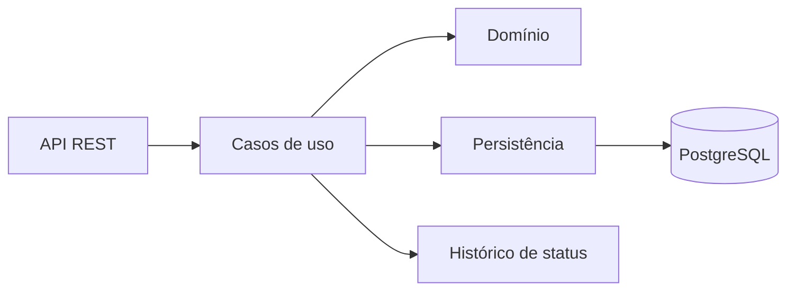

# Ryan QA Labs — AssistLar

Plataforma fictícia de assistências residenciais criada para aprender e demonstrar práticas de Quality Engineering em uma aplicação controlada, autoral e próxima de um produto real.

> Este projeto é exclusivamente educacional. Não representa nem reproduz sistemas, dados, nomes ou regras de empresas reais.

## O que este portfólio demonstra

- regras de negócio testáveis e estados com transições explícitas;
- testes unitários, de controller, integração, API, banco e concorrência;
- PostgreSQL real nos testes com Testcontainers, sem H2;
- migrations versionadas e validadas com Flyway;
- erros REST consistentes com `ProblemDetail`;
- contrato OpenAPI verificado automaticamente;
- quality gate de cobertura com JaCoCo;
- ambiente reproduzível com Docker Compose.

## Domínio do MVP

O AssistLar permite cadastrar clientes, consultar planos, avaliar elegibilidade, criar e ativar contratações e solicitar serviços de eletricista, encanador ou chaveiro.

Os planos são carregados por migration:

| Plano | Eletricista | Encanador | Chaveiro |
|---|---:|---:|---:|
| ESSENCIAL | 1 | 1 | Não coberto |
| COMPLETO | 2 | 2 | 1 |

Regras centrais:

- cliente pode ser menor de idade, mas precisa ter 18 anos completos para contratar;
- data de nascimento futura ou idade superior a 120 anos é inválida;
- só pode existir uma contratação `PENDENTE` ou `ATIVA` por cliente;
- contratação nasce `PENDENTE` e é ativada pelo operador;
- solicitação exige contratação ativa, cobertura e limite disponível;
- uma solicitação `EM_ATENDIMENTO` exige motivo para ser cancelada;
- solicitações `ABERTA`, `EM_ATENDIMENTO` e `CONCLUIDA` consomem limite; `CANCELADA` libera o consumo;
- mudanças de estado geram histórico na mesma transação.

## Arquitetura

Monólito modular em um único módulo Maven, com camadas usadas somente quando necessárias.



Pacote-base: `br.com.ryanqalabs.assistlar`.

Módulos: `cliente`, `plano`, `elegibilidade`, `contratacao`, `solicitacao`, `historico` e `compartilhado`. Veja [a documentação de arquitetura](docs/arquitetura.md).

## Stack

- Java 21 e Spring Boot 4.1.0;
- Maven Wrapper;
- PostgreSQL `17.10-alpine3.24`;
- Flyway e Spring Data JPA;
- Springdoc OpenAPI 3.0.3;
- JUnit 5, Mockito e MockMvc;
- Testcontainers 2.0.5 e REST Assured 6.0.0;
- JaCoCo e Maven Enforcer;
- Docker e Docker Compose.

## Pré-requisitos

- JDK 21;
- Docker com containers Linux;
- Git.

O build aceita exclusivamente o JDK 21. Confirme `JAVA_HOME`, Maven Wrapper e IDE antes de executar.

Windows PowerShell:

```powershell
$env:JAVA_HOME = 'C:\Program Files\Java\jdk-21'
.\mvnw.cmd --version
```

Linux ou macOS:

```bash
export JAVA_HOME=/caminho/para/jdk-21
./mvnw --version
```

A saída deve informar `Java version: 21`.

## Execução

Aplicação e PostgreSQL em containers:

```bash
docker compose up --build --wait
docker compose down
```

Somente PostgreSQL no Docker e aplicação pela IDE ou Maven:

```bash
docker compose up -d postgres --wait
./mvnw spring-boot:run
```

No Windows, use `.\mvnw.cmd` no lugar de `./mvnw`.

Com a aplicação iniciada:

- Swagger UI: <http://localhost:8080/swagger-ui.html>
- OpenAPI: <http://localhost:8080/v3/api-docs>
- Health: <http://localhost:8080/actuator/health>

As credenciais do Compose são apenas locais e não devem ser usadas em outro ambiente.

## API

| Recurso | Operações principais |
|---|---|
| `/api/clientes` | cadastrar, consultar, inativar e reativar |
| `/api/planos` | listar e consultar |
| `/api/elegibilidades` | avaliar cliente e plano sem persistir resultado |
| `/api/contratacoes` | criar, consultar, ativar, cancelar e consultar histórico |
| `/api/solicitacoes-assistencia` | abrir, consultar, iniciar, concluir, cancelar e consultar histórico |

Criações retornam `201` e `Location`. Erros seguem `application/problem+json`: `400` para entrada inválida, `404` para recurso inexistente, `409` para conflito e `422` para regra de negócio.

O MVP não possui autenticação. UUID é identificador, nunca mecanismo de autorização. Uma [jornada manual reproduzível](docs/jornada-principal.md) complementa o Swagger.

## Testes e quality gate

```bash
./mvnw test
./mvnw verify
```

- `mvn test`: testes `*Test`, com regras unitárias e camada HTTP rápida;
- `mvn verify`: suíte completa, incluindo `*IT` e `*ApiIT` com PostgreSQL real;
- JaCoCo: mínimo de 80% de instruções e 70% de branches no código relevante;
- relatório local: `target/site/jacoco/index.html` após `verify`.

Exemplo de diagnóstico de uma integração específica no PowerShell:

```powershell
.\mvnw.cmd test-compile "-Dit.test=SolicitacaoConcorrenciaIT" failsafe:integration-test failsafe:verify
```

A execução específica não substitui o `mvn verify` obrigatório. Consulte o [catálogo de cenários](docs/cenarios-de-teste.md) e as [evidências reproduzíveis](docs/evidencias.md).

## Decisões de qualidade

- datas civis usam `Clock` e `America/Sao_Paulo`;
- timestamps técnicos usam `Instant` e persistência UTC;
- transições usam optimistic locking;
- conferência de limite usa bloqueio pessimista da contratação;
- constraints parciais protegem invariantes também sob concorrência;
- testes concorrentes usam barreiras e timeout, nunca espera arbitrária;
- `tipoResponsavel` é definido pelo caso de uso e rejeitado nos payloads.

## Fora do MVP

React, autenticação, Playwright, Cypress, Selenium, acessibilidade web, k6, JMeter, GitHub Actions, notificações, rede de prestadores, geolocalização, agendamento, pagamento, sinistro, corretor, vigência, cloud e microsserviços.

Evoluções prioritárias: interface React com Playwright, testes de performance com k6, segurança básica e pipeline no GitHub Actions.

## Repositório e licença

Slug planejado: `ryan-qa-labs-assistlar`.

Distribuído sob a licença MIT.
