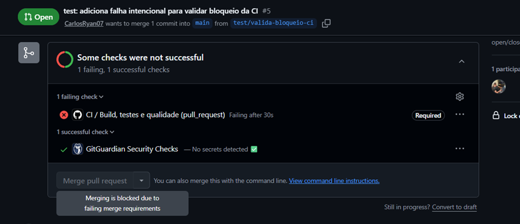

# Evidências reproduzíveis

Evidências não são relatórios binários versionados. Elas são comandos e resultados verificáveis por qualquer pessoa após clonar o projeto.

## Ambiente

```bash
./mvnw --version
docker version
docker compose version
```

Critério: Maven Wrapper usando Java 21 e Docker disponível.

Baseline local de 20/07/2026: JDK 21 confirmado, Docker Engine 24.0.6 e Docker Compose 2.23.0.

## Suíte rápida

```bash
./mvnw test
```

Critério: todos os testes `*Test` aprovados.

Baseline local: 51 testes rápidos aprovados.

## Suíte completa

```bash
./mvnw verify
```

Critérios:

- testes unitários, HTTP, integração, API, banco e concorrência aprovados;
- PostgreSQL `postgres:17.10-alpine3.24` iniciado pelo Testcontainers;
- JaCoCo acima de 80% de instruções e 70% de branches;
- relatório disponível em `target/site/jacoco/index.html`.

Baseline local de 21/07/2026: 51 testes rápidos e 30 testes de integração/API aprovados, com 97,07% de instruções e 95,71% de branches cobertos.

## Container

```bash
docker compose up -d --build --wait
curl http://localhost:8080/actuator/health
curl http://localhost:8080/v3/api-docs
docker compose down
```

Critérios: serviços saudáveis, health `UP`, OpenAPI acessível e containers removidos após a validação.

Baseline local: aplicação e PostgreSQL ficaram `healthy`; health retornou `UP`, OpenAPI 3.1 publicou 18 caminhos, Swagger respondeu `200` e o Actuator não expôs `/info` (`404`).

## Migrations

`MigracoesBancoIT` inicia um banco vazio e verifica:

- três migrations aplicadas com sucesso;
- dois planos e cinco coberturas;
- ausência de cobertura `CHAVEIRO` no ESSENCIAL.

## Concorrência

- `ContratacaoConcorrenciaIT`: duas inserções simultâneas deixam uma única contratação vigente.
- `SolicitacaoConcorrenciaIT`: aberturas simultâneas respeitam o limite e inícios simultâneos geram uma única transição.

Os testes usam `CountDownLatch`, timeout e inspeção do estado final do banco, sem `sleep`.

## Jornada principal

A jornada documentada foi reproduzida no ambiente do Compose: cliente elegível, contratação `PENDENTE → ATIVA` e solicitação `ABERTA → EM_ATENDIMENTO → CONCLUIDA`, com os três registros no histórico.

## Integração contínua

O workflow de CI foi validado durante o Pull Request e novamente após o merge na `main`. As duas execuções utilizaram Java 21 e o Maven Wrapper para executar `clean verify`, iniciaram o PostgreSQL dos testes pelo Testcontainers e publicaram os relatórios do Surefire, Failsafe e JaCoCo no artefato `quality-reports`.

### Teste negativo e proteção da main

Uma branch temporária foi criada com um teste contendo uma falha intencional. O GitHub Actions detectou a regressão, e o check obrigatório `Build, testes e qualidade` manteve o botão de merge desabilitado. O Pull Request foi fechado e a branch temporária foi excluída sem integração na `main`.



## Evidências visuais

As imagens complementam os comandos reproduzíveis e registram a validação visual do MVP:

- [Swagger e contrato da API](assets/swagger-api.png)
- [Jornada principal no Postman](assets/postman-jornada-principal.png)
- [Cenário negativo com ProblemDetail](assets/postman-problem-detail.png)
- [Resultado agregado da suíte](assets/testes-81-build-success.png)
- [Cobertura JaCoCo](assets/jacoco-cobertura.png)
- [Docker Compose saudável](assets/docker-compose-healthy.png)
- [Pipeline de qualidade aprovada no GitHub Actions](assets/github-actions-ci-aprovada.png)
- [Falha detectada pela CI e merge bloqueado](assets/github-actions-merge-bloqueado.png)
